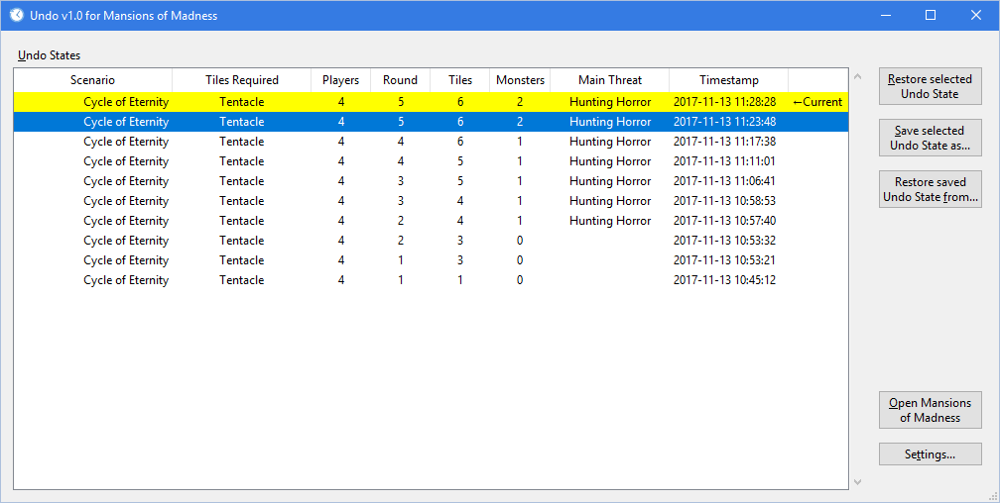

# Undo for FFG Games  #

*Undo* adds a "poor man's" undo capability to the Windows companion apps for FFG board games, including Mansions of Madness Second Edition, Descent Second Edition - Road to Legend and Star Wars: Imperial Assault - Legends of the Alliance. [Download links are below](#installation).

To use it, start this Undo app *before* starting the companion app. While you're playing, the Undo app will take snapshots (called "Undo States") of the game's state at various times, e.g. for Mansions of Madness this includes the beginning of each Investigator Phase, and also just before the End Investigator Phase button is clicked.

If you click something by accident which you need to undo, Save and Quit to the main menu, then switch to the Undo app (or exit the companion app entirely if you prefer) and select an Undo State to restore. When you continue your game in the companion app, you'll start at the point when the Undo State snapshot was taken.

------------------------------------------------------------

Here's what the Undo window looks like for Mansions of Madness:

After you Save and Quit to the main menu in the Mansions of Madness app, the Current Undo State (highlighted in yellow) is the same as the "normal" MoM game save (the one that's loaded when you click Continue in the main menu.) If you need to undo any actions, choose one of the *other* Undo states. Usually you'd choose the second undo state (highlighted in blue) and then click the **Restore selected Undo State** button. Next you can click the **Open Mansions of Madness** button to return to the MoM app, and then click Continue. Be sure you don't close the Undo app in case you need it again!

The **Save selected Undo State as...** button saves a copy of an Undo State to somewhere else on your drive (it's essentially a game save file which won't get automatically overwritten). It could be useful if you're in the middle of a game with one group, and decide to start a game with another group using the same PC but don't want to lose the game save for the first group. It can also be used to transfer Undo States from one PC to another.

The **Restore saved Undo State from...** button restores an Undo State to the MoM app that you saved above.

Finally, the **Settings...** button allows you to change how many Undo States are stored before the oldest one is deleted to make room for a new one. This defaults to 20 Undo States. For games with multiple save slots, this is the number saved per save slot.

## Installation ##

#### The easy way ####

Visit the [releases page](https://github.com/gurnec/Undo_FFG/releases/latest), and then download and run the most recent `Undo_for_FFG_setup.exe` installer.

#### Running from source instead ####

If you'd prefer to run Undo for FFG Games from the Python source code directly:

 1. Visit the Python download page here: <https://www.python.org/downloads/windows/>, and click the link for the latest **Python 3.8** release. Download and run either the `Windows x86 web-based installer` for the 32-bit version of Python, or the `Windows x86-64 web-based installer` for the 64-bit one. Modern PCs can use the 64-bit version, however if you're unsure which one is compatible with your PC, choose the 32-bit one.

 2. Download the latest version of Undo for FFG Games from <https://github.com/gurnec/Undo_FFG/archive/master.zip> and unzip it to a location of your choice.
 
 3. In the folder you unzipped above, double-click the `Undo_MoM2e.pyw` file for Mansions of Madness, `Undo_RtL.pyw` for Road to Legend, `Undo_LotA.pyw` for Legends of the Alliance, or `Undo_JiME.pyw` for Journeys in Middle-Earth.

## Q & A ##

##### How does it work? #####

The FFG companion apps automatically overwrite the current game save at certain pre-determined times during the game, and also whenever you Save and Quit to the main menu. The Undo app simply monitors for these game saves, and copies them elsewhere so they no longer get overwritten.

##### Can you increase the frequency that Undo States are preserved? #####

No, not automatically, but if you want to create a new Undo State manually, just Save and Quit *to* the main menu and then you can immediately click Continue or Load Game (you don't need to Quit *out of* the main menu). Undo will notice the new game save and create a new Undo State.

##### Would you make a translation for language X? #####

Although it's not multilingual at the moment, if someone offered to translate all of the phrases used (I'd provide a list) into a new language, I'd be happy to add it.  

##### Would you make a version for Android / iOS / Mac? #####

Android and iOS would require a rooted / jailbroken device... so no, I have no plans to ever make a version of Undo for those platforms.

Mac is a remote possiblility though, if I receive requests for it and can find the time.

##### Are there any bugs? What should I do if I find one? #####

Yup, there are probably bugs, especially when it comes to displaying information in the Undo app that is extracted from the game saves. If you encounter a bug, please open an [issue here](https://github.com/gurnec/Undo_FFG/issues/new). If your bug relates to a particular Undo State, please use the *Save selected Undo State as...* button to save it to a file and attach that file to the issue.
